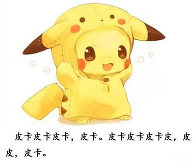

# PCKit - PikkaCho Kit
- PikkaCho Kit is a elegant handler for Matlab &amp; PsychToolBox events
- it also supply object-oriended programming wrap over PsychToolBox
- As the picture indicate, the PikkaCho Kit is also a cute and lovely Kit:)


## How to use
- before initialize the PCRunloop instance, it is **recommended** to use `Screen('OpenWindow', 0, [0 0 0])` to open a window with PsychToolBox(because PTB may draw the big big yellow triangle to warn you about some sync problems, and that will disturb the time record of PCKit), but you can **also** explicitly set the PCRunloop.startTime before call the PCRunloop.run method.
- use `runloop = PCRunloop(@(obj)endJudger, @()endCallBack);` to initialize a PCRunloop instance, and the `endJudger` is a function that return a boolean to indicate whether the runloop is end and the `endCallBack` will be called after the runloop is ended.
- initialize an event using `event = PCEvent(eventName,@()fireJudger,repeated);` `eventName` is used to identify the event, so ***don't*** let different event to have the same eventName. `fireJudger` is a function that return a boolean to indicate whether the event is fired. And `repeated` indicate whether the event will be destroyed after fist fire.
- then add the event to runloop using `runloop.register(event, @()callback);` the `callback` is a function that will be called when the event's fireJudger return true.
- **Notice**: you can register many callback on the same event by calling `runloop.register()` many times. And PCKit will call the callback one by one when fireJudger returns true, in the order they are registered. Again, **Don't** let two event have the same eventName!
- you can also check out the [example](./Example/) in the repo to understand how to use PCKit~

## Object-oriented programming graphic
### Now support:
- FixationPoint(cross, oval)
- Oval
- Rectangle

### Usage:
- initialize an object by calling its constructor, like 
```matlab
fixationPoint = PCFixationPoint(w,...
                PCdeg2pix(0.5, SCREEN_SIZE_INCH, VIEW_DISTANCE), ...
                PCdeg2pix(0.5, SCREEN_SIZE_INCH, VIEW_DISTANCE), ...
                PCFixationPointType.oval);
```
- then call its draw() method, like `fixationPoint.draw();`, it will draw itself at the buffer, which means you need to `Screen('Flip', w)` after you draw every object you need

## Happy Using PikkaCho Kit~ Feel free to issue and pr to this repo!


